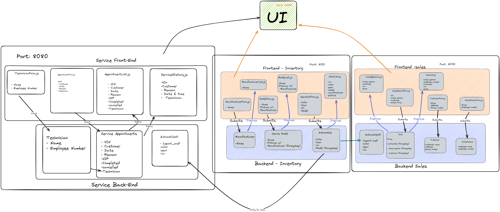

# CarCar

Team:

* John Jackson - Sales 
* Rodrigo Olmos - Service 

## Design



## How to run: 
Fork and Clone Repository
Run the following commands in the terminal
```
docker volume create beta-data

docker-compose build

docker-compose up
```
## Inventory microservice
The inventory microservice is a tool that can be used to create and keep track of automobiles at a car dealership, that then distributes its data to other microservices; the service microservice, and sales microservice. The built in services of the Inventory allow the user to create a manufacture, create a model with a picture url field, and finally create an automobile with a unique VIN to identify it.

## Service microservice

Explain your models and integration with the inventory
microservice, here.

## Sales microservice
The sales microservice is a tool that can be used to track important information for a car dealership regarding the sales team and sales of the automobiles. It pulls data from the inventory microservice to assign an automobile and its details to a sale. Built in services include: a create sales team member form, a create customer form, a list view of all sales made, a list view of sales filtered by the sales team member that made  the sale, and a create sales record form that filters out the already sold automobiles as to not sell the same automobile twice. 


Ports and URLs to access the browser
Port 3000: For Browser access

    Inventory:

        Manufacturer:

            Form: http://localhost:3000/manufacturer/new
            List: http://localhost:3000/manufacturer/

        Vehicle Models:
            Form: http://localhost:3000/models/new
            List: http://localhost:3000/models/

        Automobile:
            Form:http://localhost:3000/automobiles/new
            List:http://localhost:3000/automobiles/

    Sales:
        Sales Person Form: http://localhost:3000/sales-team/
        Customer Form: http://localhost:3000/customer/
        Sale Record Form: http://localhost:3000/sales-record/
        List of All Sales: http://localhost:3000/sales-list-all/
        Sales Person History: http://localhost:3000/sales-by-person/

Port 8090: For accessing Sales api's URL's in CRUD section below
Port 8100: For accessing Inventory Api


CRUD:
Sales Person: Creates, shows and deletes a sales person comprised of an employee name and employee number (integer field max length 6)

        POST:  http://localhost:8090/api/employees/
        Sample Input:{
	                    "employee_name": "John Employee",
	                    "employee_number": "123456"
                    }
        Expected Output:{
                        "id": 3,
                        "employee_name": "John Employee",
                        "employee_number": "123456"
                    }

    GET LIST: http://localhost:8090/api/employees/
        Expected Output:{
                            "employee": [
                                {
                                    "id": 3,
                                    "employee_name": "John Employee",
                                    "employee_number": "123456"
                                }
                            ]
                        }

    GET DETAIL: http://localhost:8090/api/employees/id/
        Expected output:{
                            "id": 3,
                            "employee_name": "John Employee",
                            "employee_number": "123456"
                        }

    DELETE: http://localhost:8090/api/employees/id/
        Expected Output: {
                            "deleted": true
                        }

Customer: Creates, shows and deletes a new potential customer comprised of the customers name, address and phone number(integer field max 10 characters)

    POST: http://localhost:8090/api/customers/
    Sample Input:{
                    "customer_name": "John Customer",
                    "address": "1234 Main st",
                    "phone_number": "1234567890"
                }
    Expected Output:{
                    "id": 2,
                    "customer_name": "John Customer",
                    "address": "1234 Main st",
                    "phone_number": "1234567890"
                }

    GET LIST:http://localhost:8090/api/customers/
    Expected Output:{
                    "customers": [
                        {
                            "id": 2,
                            "customer_name": "John Customer",
                            "address": "1234 Main st,
                            "phone_number": "1234567890"
                        }
                    ]
                }

    GET DETAIL: http://localhost:8090/api/customers/id/
    Expected Output:{
                    "id": 2,
                    "customer_name": "John Customer",
                    "address": "1234 Main st",
                    "phone_number": "1234567890"
                }

    DELETE: http://localhost:8090/api/customers/id/
    Expected Output:{
                    "message": true
                }

Sale: Creates, shows, and deletes a sale record. Created from an existing vin from inventory, an existing employees name, an existing customers name, and the sale price.

    POST: http://localhost:8090/api/sales/
    Sample Input:{
                    "automobile": "12345678901234567",
                    "sales_person": "John Employee",
                    "customer": "John Customer",
                    "price": "123456"
                }
    Expected Output:{
                    "href": "/api/sales/4/",
                    "id": 4,
                    "price": "123456",
                    "automobile": {
                        "color": "grey",
                        "year": 2023,
                        "vin": "12345678901234567",
                        "import_href": "/api/automobiles/12345678901234567/"
                    },
                    "sales_person": {
                        "id": 3,
                        "employee_name": "John Employee",
                        "employee_number": "123456"
                    },
                    "customer": {
                        "id": 2,
                        "customer_name": "John Customer",
                        "address": "1234 Main st",
                        "phone_number": "1234567890"
                    }
                }

    GET LIST: http://localhost:8090/api/sales/
    Expected Output: {
                        "sales": [
                            {
                                "href": "/api/sales/4/",
                                "id": 4,
                                "price": 123456,
                                "automobile": "12345678901234567",
                                "sale_person": "John Employee",
                                "employee_number": "123456",
                                "customer": "John Customer"
                            }
                        ]
                    }

    GET DETAIL: http://localhost:8090/api/sales/id/
    Expected Output: {
                        "href": "/api/sales/4/",
                        "id": 4,
                        "price": 123456,
                        "automobile": {
                            "color": "grey",
                            "year": 2023,
                            "vin": "12345678901234567",
                            "import_href": "/api/automobiles/12345678901234567/"
                        },
                        "sales_person": {
                            "id": 3,
                            "employee_name": "John Employee",
                            "employee_number": "123456"
                        },
                        "customer": {
                            "id": 2,
                            "customer_name": "John Customer",
                            "address": "1234 Main st",
                            "phone_number": "1234567890"
                        }
                    }

    DELETE: http://localhost:8090/api/sales/id/
    Expected Output: {
                        "deleted": true
                    }


